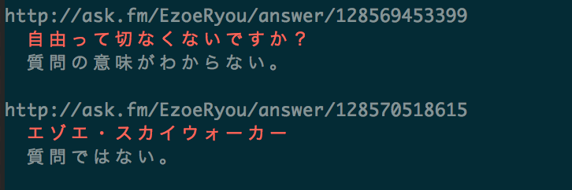

# ezoe

質問ではない

***DEMO:***

## Requirements

- bash 3.2 or more
- curl

## Usage

listing questions/answers

	$ ./ezoe.sh
	
- [ ] post question (TODO)

		$ ./ezoe.sh 今日の朝ごはんは何ですか？

### Quick start

	$ curl -L https://raw.githubusercontent.com/b4b4r07/ezoe/master/ezoe.sh | bash

## Installation

	$ git clone https://github.com/b4b4r07/ezoe

## License

[MIT](https://raw.githubusercontent.com/b4b4r07/dotfiles/master/doc/LICENSE-MIT.txt)

## Author

[BABAROT](http://tellme.tokyo) a.k.a. b4b4r07
